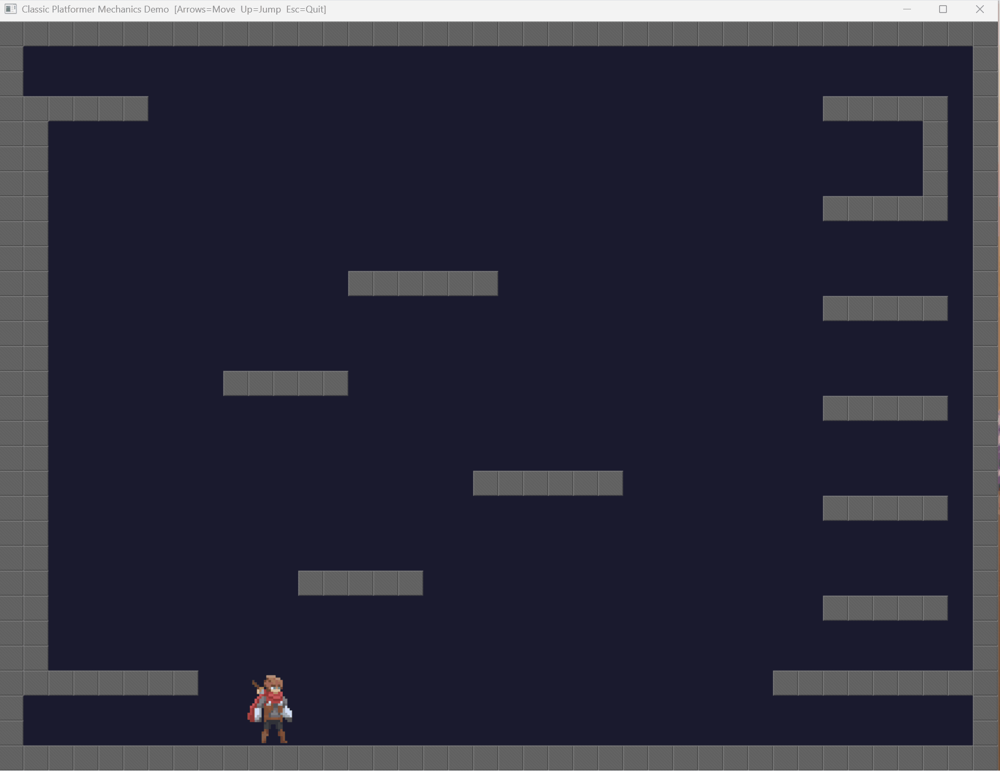
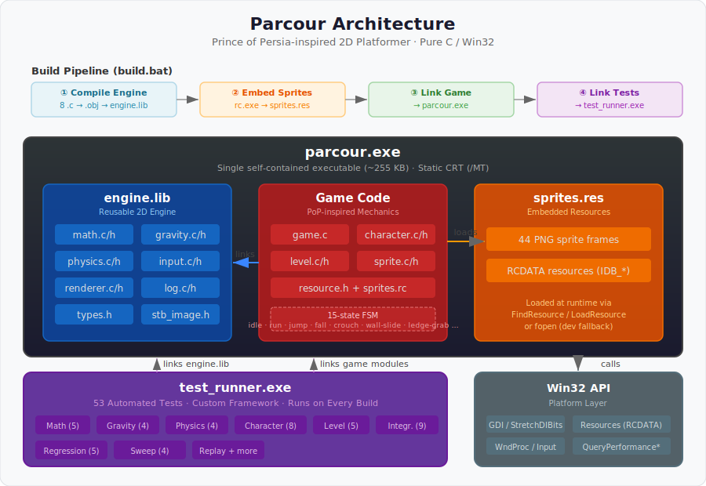

# Parcour

[](../../actions/workflows/build.yml)
[](LICENSE)

A **Prince of Persia**-inspired 2D platformer built from scratch in **pure C** using the **Win32 API** — no game engine, no middleware, no external dependencies.

All 44 sprite frames are embedded as Win32 resources, producing a **single self-contained executable** (~255 KB) that runs on any 64-bit Windows machine with zero runtime dependencies.

---

## 📸 Demo



---

## ✨ Features

- **Pure C / Win32** — no C++, no game engine, no frameworks
- **Custom 2D engine** — math, gravity, physics, input, renderer, logging
- **15-state character FSM** — idle, run, jump, fall, crouch, wall-slide, ledge-grab, somersault, and more
- **PoP-style physics** — quadratic air drag, asymptotic terminal velocity, tile-based AABB collision
- **Wall vs. platform distinction** — thin platforms passable horizontally, only block from above
- **Ledge mechanics** — corner-grab from air, head-height grab from ground, auto-climb on forward hold
- **Framebuffer rendering** — direct pixel manipulation via `UINT32[]` array blitted with `StretchDIBits`
- **52 automated tests** — custom test framework, runs on every build
- **Single-file deployment** — sprites embedded as RC resources, static CRT linking (`/MT`)

---

## 🚀 Quick Start

### Prerequisites

| Tool | Version | Notes |
|------|---------|-------|
| **Visual Studio** | 2019 or later | Any edition (Community is free) |
| **"Desktop development with C++" workload** | — | Must be selected during VS install |

That's it. No other installs, no package managers, no CMake, no vcpkg.

### Step-by-Step

**1. Clone the repository**
```bash
git clone https://github.com/YOUR_USERNAME/Parcour.git
cd Parcour
```

**2. Open a Developer Command Prompt**

You need MSVC tools (`cl.exe`, `lib.exe`, `rc.exe`) on your PATH. Three ways to do this:

| Method | How |
|--------|-----|
| **Easiest** | Open **"Developer Command Prompt for VS 2022"** from the Start Menu |
| **PowerShell** | Run: `& "C:\Program Files\Microsoft Visual Studio\2022\Community\VC\Auxiliary\Build\vcvars64.bat"` |
| **VS Code** | Install the "C/C++" extension, open an integrated terminal — it auto-detects VS |

> **Tip:** The build script auto-detects VS 2022, VS 2019, and Insiders editions. If `cl.exe` is already on your PATH, it uses that directly.

**3. Build and test**
```cmd
build.bat fre
```

This runs the full 4-stage pipeline:
1. Compiles engine sources → `engine.lib`
2. Embeds 44 sprite PNGs → `sprites.res`
3. Links game → `parcour.exe`
4. Links tests → `test_runner.exe` (auto-runs, 52 tests)

**4. Run the game**
```cmd
build\amd64fre\parcour.exe
```

### Build Commands

| Command | What it does |
|---------|-------------|
| `build.bat fre` | Release build + run tests |
| `build.bat chk` | Debug build (with PDB symbols) + run tests |
| `build.bat all` | Build both configs + run tests |
| `build.bat clean` | Delete all build artifacts |
| `build.bat notest` | Release build without running tests |

---

## 🎮 Controls

| Key | Action |
|-----|--------|
| **← →** | Walk / Run |
| **↑** | Jump |
| **↓** | Crouch |
| **Space** | Grab ledge (when near edge) |

---

## 📁 Project Structure

```
Parcour/
├── build.bat                 # Build script (4-stage pipeline)
├── src/
│   ├── engine/               # Reusable 2D engine (→ engine.lib)
│   │   ├── math.c/h          #   Vector math, AABB
│   │   ├── gravity.c/h       #   Quadratic gravity with air drag
│   │   ├── physics.c/h       #   Tile-based collision resolution
│   │   ├── input.c/h         #   Keyboard state tracking
│   │   ├── renderer.c/h      #   Framebuffer, StretchDIBits
│   │   ├── log.c/h           #   File + debug output logging
│   │   ├── types.h           #   Shared data types
│   │   └── stb_image.h       #   PNG decoder (header-only, 3rd party)
│   └── game/                 # Game-specific code (→ parcour.exe)
│       ├── game.c            #   WinMain, game loop, WndProc
│       ├── character.c/h     #   15-state FSM, animation
│       ├── level.c/h         #   40×30 tile grid
│       ├── sprite.c/h        #   Dual-mode sprite loading
│       ├── resource.h        #   RC resource IDs
│       └── sprites.rc        #   Win32 resource script (44 PNGs)
├── test/                     # 52 automated tests
│   ├── engine/               #   Math, gravity, physics tests
│   └── game/                 #   Character, level, integration tests
├── sprites/                  # 44 PNG sprite frames (embedded at build time)
├── doc/DESIGN.md             # Comprehensive design document (~1400 lines)
└── build/                    # Build output (gitignored)
```

---

## 🏗️ Architecture



- **Engine** (`engine.lib`) — generic, reusable 2D game engine (no game-specific knowledge)
- **Game** — Prince of Persia-inspired character controller, 15-state FSM, levels, sprites
- **Resources** (`sprites.res`) — all 44 sprite PNGs baked into the executable at build time
- **Tests** (`test_runner.exe`) — 53 automated tests across 9 categories, runs on every build

---

## 🧪 Testing

The project includes **52 automated tests** in a custom test framework:

| Category | Tests | What it covers |
|----------|-------|---------------|
| Math | 5 | Vector ops, clamping, AABB overlap |
| Gravity | 4 | Free-fall, terminal velocity, drag |
| Physics | 4 | Tile collision, floor/wall detection |
| Character | 8 | State machine transitions |
| Level | 5 | Tile queries, bounds checking |
| Integration | 9 | Multi-system flows (jump→fall→land) |
| + others | 17 | Input, renderer, sprite, animation |

Tests run automatically on every build. To run manually:
```cmd
build\amd64fre\test_runner.exe
```

---

## 📖 Documentation

See **[doc/DESIGN.md](doc/DESIGN.md)** for the comprehensive design document covering:
- Architecture and module reference
- Physics system and gravity model
- Character state machine (15 states)
- Sprite and rendering pipeline
- Build system internals
- Key design decisions and trade-offs

---

## 🎨 Credits

- **Sprite assets:** "Animated Pixel Adventurer" by [rvros](https://rvros.itch.io/) (itch.io) — open-source pixel art
- **PNG decoder:** [stb_image.h](https://github.com/nothings/stb) by Sean Barrett — public domain
- **Inspiration:** *Prince of Persia* (1989, Apple II) by Jordan Mechner

---

## 📄 License

This project is licensed under the MIT License — see [LICENSE](LICENSE) for details.

Sprite assets are used under their original license terms from the creator (rvros on itch.io).

---

## 🏷️ GitHub Topics

When creating the repository, add these topics for discoverability:

`c` · `win32` · `platformer` · `game-engine` · `2d-game` · `prince-of-persia` · `retro` · `pixel-art` · `game-development` · `parcour` · `learning-project`

---

## 🤝 Contributing

Contributions are welcome! See [CONTRIBUTING.md](CONTRIBUTING.md) for guidelines on:
- Reporting bugs and requesting features
- Coding style and architecture conventions
- How to add new modules and tests
